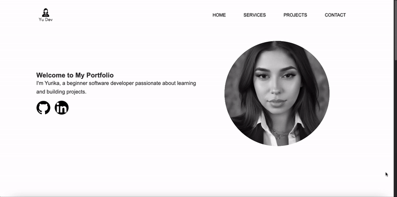

# Portfolio Website

This is a portfolio website built with **React** and **Vite**.

## Project Overview

In this project, I aimed to create a minimalist and modern layout that is easy to navigate and highlights the developer's main professional skills. The website consists of four sections:

- **Home**  
- **Services**  
- **Projects**  
- **Contact**  

## Features

- **Interactive Design:** Hovering over buttons or cards triggers a zoom effect for an engaging user experience.  
- **Redirect Functionality:** Clicking on buttons and cards redirects the user to other web pages.

## Preview

## Technologies Used

- React  
- Vite  
- HTML5  
- CSS3  
- JavaScript  

